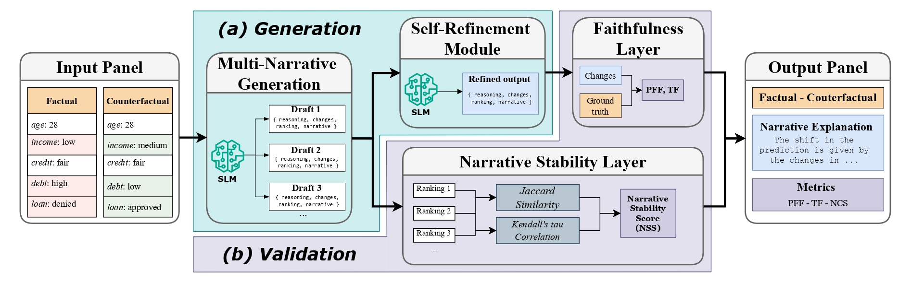
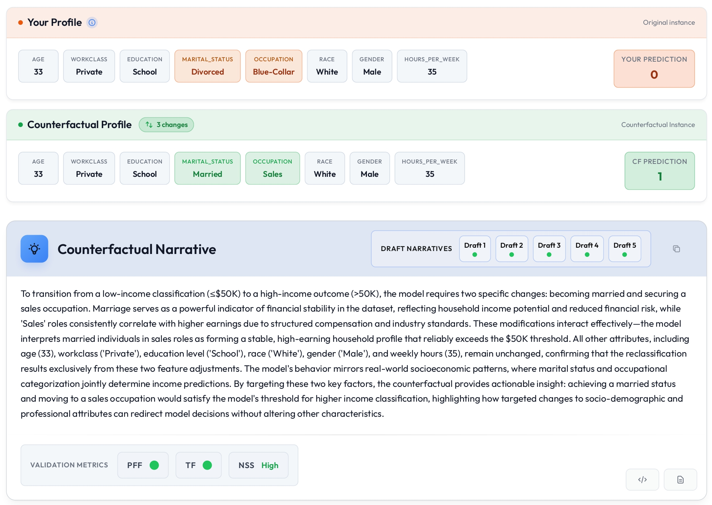

# Narrative Explanation Systems with SLMs

A modern, full-stack web application for generating human-readable counterfactual narrative explanations using Large Language Models (LLMs). This application provides an intuitive interface for exploring how changes in input features affect model predictions through natural language explanations.





## 🚀 Quick Start

### Prerequisites

- **Python 3.8+**
- **Node.js 16+**
- **Git** (for submodule management)
- **GPU with CUDA** (optional, for vLLM models)

### Initial Setup

1. **Clone the repository with submodules:**
   ```bash
   git clone --recurse-submodules <repository-url>
   cd xai-narrative-webapp
   ```

   If you already cloned without submodules:
   ```bash
   git submodule update --init --recursive
   ```

2. **Start the backend:**
   ```bash
   cd webapp
   ./start-backend.sh
   ```

3. **Start the frontend** (in a new terminal):
   ```bash
   cd webapp
   ./start-frontend.sh
   ```

4. **Open your browser:**
   Navigate to `http://localhost:5173`

## ✨ Features

- **🎯 Dataset Support**: Adult Income, Titanic, California Housing, Diabetes
- **🤖 Multi-Model Support**: 
  - vLLM models (local GPU inference)
- **🔄 Dynamic Counterfactuals**: Load new counterfactuals for the same factual instance
- **📊 Visual Comparison**: Side-by-side comparison with highlighted differences
- **📝 Narrative Explanations**: Human-readable explanations generated by LLMs
- **🌓 Light/Dark Theme**: Toggle between light and dark themes
- **🎨 Fine-tuned Models**: Option to run fine-tuned models (available on [Hugging Face](https://huggingface.co/phdsilver22/models) or base models
- **🔧 Refiner Pipeline**: Toggle refiner pipeline on or off
- **📋 Copy to Clipboard**: Easy sharing of explanations

## 📁 Project Structure

```
xai-narrative-webapp/
├── llm_kd/                    # Git submodule - LLM pipeline repository
│   ├── src/
│   │   ├── utils.py           # MODEL_MAPPING and prompt templates
│   │   └── pipeline.py        # LLM pipeline implementation
│   └── data/
│       └── dataset_kb.py      # Dataset knowledge base
├── webapp/                    # Main application directory
│   ├── backend/               # FastAPI backend
│   │   ├── api/              # API endpoints
│   │   ├── services/         # Business logic
│   │   └── requirements.txt  # Python dependencies
│   └── frontend/             # React frontend
│       ├── src/              # React components
│       └── package.json     # Node dependencies
├── README.md                 # This file
├── SETUP.md                  # Detailed setup guide
└── .gitmodules              # Git submodule configuration
```

## 📚 Documentation

- **[Webapp README](webapp/README.md)**: Detailed documentation for the webapp
- **[Quick Start Guide](webapp/QUICKSTART.md)**: Step-by-step setup instructions
- **[Setup Guide](SETUP.md)**: llm_kd integration and submodule management

## 🔧 Configuration

### Environment Variables

Create a `.env` file in `webapp/backend/`:

```bash
# GPU Configuration (for vLLM)
TENSOR_PARALLEL_SIZE=1
GPU_MEMORY_UTILIZATION=0.9

# API Configuration
API_HOST=0.0.0.0
API_PORT=8000
```

## 🔄 Updating the llm_kd Submodule

To sync with the latest changes from the llm_kd repository:

```bash
cd llm_kd
git pull origin main  # or your branch
cd ..
git add llm_kd
git commit -m "Update llm_kd submodule"
```

## 🧪 Usage

1. **Select a Dataset**: Choose from Adult Income, Titanic, California Housing, or Diabetes
2. **Select a Model**: Choose a vLLM model (requires GPU)
3. **Load Example**: Click "Load Example" to fetch a factual/counterfactual pair
4. **New Counterfactual**: Click "New Counterfactual" to get a different counterfactual for the same factual
5. **Generate Explanation**: Click "Generate Explanation" to create a narrative explanation
6. **View Results**: See the explanation, feature changes, and target variable changes

## 🤝 Contributing

1. Ensure llm_kd submodule is up to date
2. Make changes in the appropriate directory (`webapp/backend/` or `webapp/frontend/`)
3. Test your changes locally
4. Submit a pull request

## 🎯 Project Goals

This application aims to:
- Provide an intuitive interface for exploring counterfactual explanations
- Support multiple LLM backends (local and cloud)
- Generate high-quality, human-readable narrative explanations
- Enable easy comparison of different counterfactual scenarios

---

For detailed setup instructions, see [webapp/QUICKSTART.md](webapp/QUICKSTART.md) or [SETUP.md](SETUP.md).

